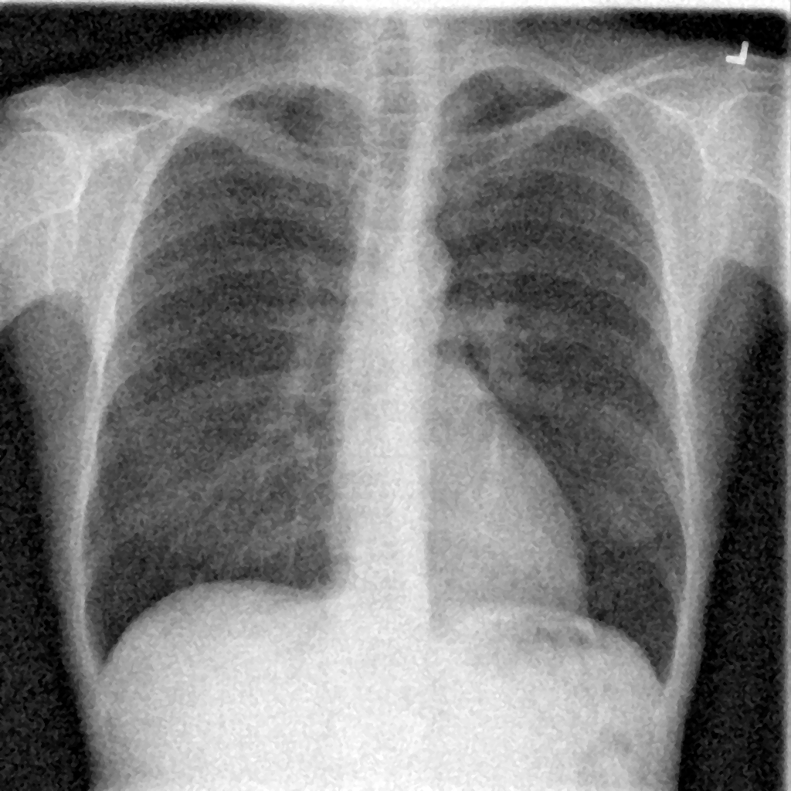
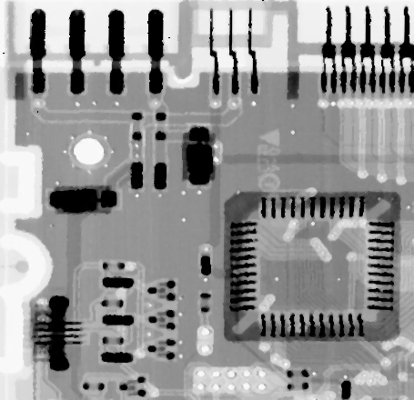

# Assigment 32


# 1.Convolution_2D
+ In this project, applied 5 different kernels on input image to see the difference of kernels. here is list of kernels:

    ```
    # 1. Edge detection filter
        kernel = np.array([[-1 , -1 , -1],
                           [-1 ,  8 , -1],
                           [-1 , -1 , -1]])

        # 2. Sharpening filter
        kernel = np.array([[0  , -1 ,  0],
                           [-1 ,  5 , -1],
                           [0  , -1 ,  0]])
 
        # 3. Emboss filter
        kernel = np.array([[-2 , -1 ,  0],
                           [-1 ,  1 ,  1],
                           [0  ,  1 ,  2]])

        # 4. Identity filter
        kernel = np.array([[0  ,  0 ,  0],
                           [0  ,  1 ,  0],
                           [0  ,  0 ,  0]])

        # 5. Your filter
        kernel = # what ever you want```

## How to Install
Run following command:
```
pip install -r requirments.txt
```


## How to Run
Execute this command in terminal:

```
python 1_Convolution_2D.ipynb
```
## Input


# Results
 ## Edge detection filter

## Sharpening filter

## Emboss filter

## Identity filter

## Edge_image_Sheep


------------------------------------------------------

# 2.Average Filter
+ In this project, applied median kernels in different size (3,5,7,9) on input image to reduce the noise of them, also median filter applied twice if needed.

## How to Install
Run following command:
```
pip install -r requirments.txt
```

## How to Run
Execute this command in terminal :
```
python 2_Average_Filter.ipynb
```

# Results


-----------------------------------------
# 3.Median_Filter
+ In these projects we use median filter to remove salt-and-pepper noise on some images.
there is a function in python for this operation call medianBlur.

## How to Install
Run following command:
```
pip install -r requirments.txt
```

## How to Run
Execute this command in terminal :
```
python 3_Median_Filter
```

# Results
## Before

## After

## Before

## After

## Before

## After

## Before

## After

## Before

## After

## Before

## After


-----------------------------------------
# 4.Histogram

+ Its an operation in image processing to enhance contrast of an image.
if the histogram of your image focus in black area or white area, then equalizeHist function can solve your problem.
But if your histograms picture is not focus in black or white area you van use CLAHE to solve your problem and 
don't lose details too.

## How to Install
Run following command:
```
pip install -r requirments.txt
```

## How to Run
Execute this command in terminal :
```
python 4_Histogram_Equalize
```


## Results


-----------------------------------------